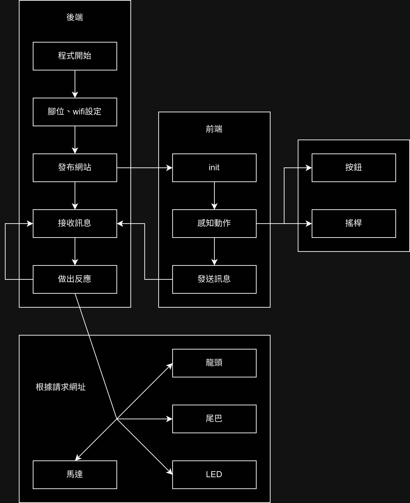

# 龍舟機器人操縱程式 V2.0

> 一個可以操控龍舟的程式

本程式是為了參與 2024 STEAM跨域競賽 龍舟組而設計的，其功能包含：

- 控制龍舟機器人移動
- 控制龍頭上下左右擺動
- 控制龍尾左右擺動
- 控制三色LED發出紅黃綠藍四色

## 使用環境

- Arduino版本：2.3.2
- 開發板：esp32(Node32s)

操控程式內含Html檔，因此使用了SPIFFS。

SPIFFS : [https://github.com/me-no-dev/arduino-esp32fs-plugin](https://github.com/me-no-dev/arduino-esp32fs-plugin)

SPIFFS 擴充 : [https://github.com/espx-cz/arduino-spiffs-upload](https://github.com/espx-cz/arduino-spiffs-upload)

## 程式邏輯

本程式透過將 Esp32 晶片設置為一個網路 AP，並且把 Html 發布至主頁（一般為192.168.4.1）。在透過手機連線後便可以透過網站操作龍舟。

程式流程圖：

 

## 常見錯誤

### SPIFFS在寫入時顯示無法開啟腳位

- 將序列塢監控視窗關閉後再次嘗試
- 切換COM再切回來試試

### SPIFFS檔案放到tools後不顯示

因為SPIFFS只支援Arduino 1.x，所以需要在[這裡](https://github.com/espx-cz/arduino-spiffs-upload)下載擴充功能。

### 找不到`ledcAttatch`或是`ledcSetUp`和`ledcAttatchPin`

Esp32 官方在 Esp3.0 時做了一個更新，將`ledcSetUp`和`ledcAttatchPin`合併成了`ledcAttatch`，詳情請參考[Esp32官方文件](https://github.com/espressif/arduino-esp32/blob/master/docs/en/migration_guides/2.x_to_3.0.rst#ledc)。

**具體解決方法**：

報錯時依據版本將程式碼替換為下列兩種（若是其中一種不行則試試另外一種）

Esp32 2.x

```c++
ledcSetUp(pin, freq, solution) ;
ledcAttatchPin(pin, pin) ;
```

Esp32 3.x or up

```c++
ledcAttatch(pin, freq, solution) ;
```

## 設計參考

搖桿(Jeff Treleaven)：[https://codepen.io/jiffy/pen/zrqwON](https://codepen.io/jiffy/pen/zrqwON)

頁面設計(AsmrProg)：[https://www.youtube.com/watch?v=sBJmRD7kNTk](https://www.youtube.com/watch?v=sBJmRD7kNTk)

## 以往設計

<a href="https://github.com/happpycorn/Esp32Cam-Car">
  
</a>
<a href="https://github.com/happpycorn/2023_DragonBoat">
  
</a>
